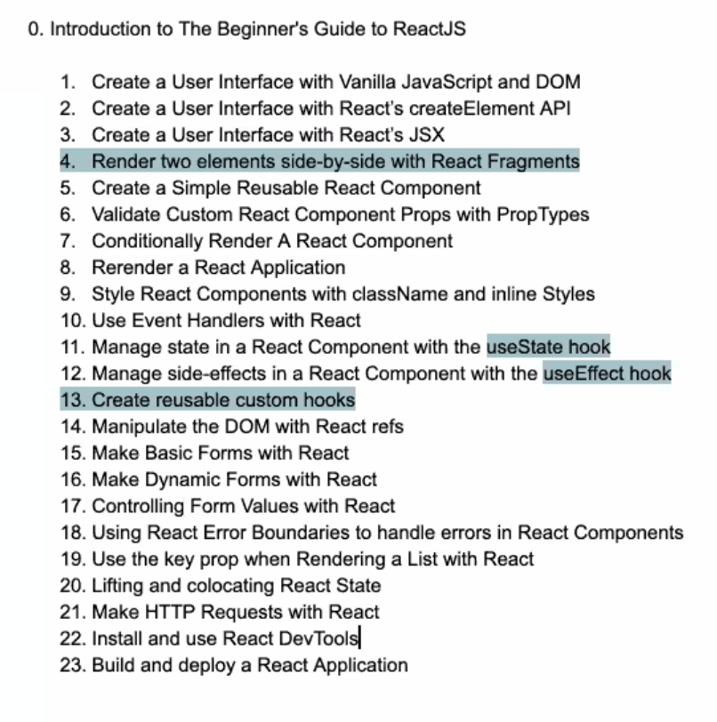

# LIVE! hatching_chick The Beginner’s Guide to React with Kent C. Dodds [Free Community Event]

Kent is moving away from Classes to Functional Components

There are so many options and as an experienced Web Developers we are able to make the distinction between the tools while new people are not able to do so

You start from the begining and able to deploy to Netlify in order to show off the work you did

This course starts from the very basics such as writing an HTML file

Each area is broken into small sections in order to be able to jump to those of interest

Understanding JSX (Create Element)

Why people should not create Classes?

* Function components are less prone to bug on Production
* We may have more bugs on DEV but less bugs on PROD.

One thing that class Components do:
*Component did Catch - cycle
Kenn gets around this limitation by using "Error Boundaries" instead

Error Boundaries it is something that everyone needs and it is important to learn.

May not go into detail on how to deploy the project but enough to be able to post it to a location.

It is recommended to follow up with React Hooks and Suspense after taking the Intro to React for beginners course https://kentcdodds.com/workshops/react-suspense

When people are getting started usually want to premature optimize
* example: buy the domain name!

Premature *anything* and this makes people spend 6 months in "what if" problems instead of creating the business

Is anything needed before taking the class?
* Start with JavaScript and focus on the modern items. 
* Read more on this post: https://kentcdodds.com/blog/how-to-react
* Take this from Wes: https://beginnerjavascript.com/
* You need minimal HTML to get into React
* You need to get a good handle of JavaScript to get into React

In the course we will learn on how to pass props and everything you need to build and scale applications but there is no room for Application State Management. Follow up on this post: https://kentcdodds.com/blog/application-state-management-with-react

There is a difference between Component State Management and Application State Management

Instead of giving multiple choices to style elements it may be recommended to use tailwind (https://tailwindcss.com/screencasts/) (https://egghead.io/playlists/introduction-to-tailwind-and-the-utility-first-workflow-0b697b10)

Help people understand EventHandles vs React Hooks

Forms:
* Render the form
* Grab the elements from the form
* Submit

No need to run, onChange handler unless you are doing real time validation

No need to create an API key for this course.

Lifting and colocate state: Resource to read: https://kentcdodds.com/blog/state-colocation-will-make-your-react-app-faster

Some topics not covered:
useReducer & useState
Classes will not be covered or it would increase the size of the lesson
Redux or any material - if you want to learn how to test it you can view more on https://testingjavascript.com
No CSS or Style Libraries - may include something about tailwind

Note: The software used is more important than release dates for egghead videos

## Personal take
This course seems to be at times to be too simplistic but it will be a great introduction for anyone just getting into React.
